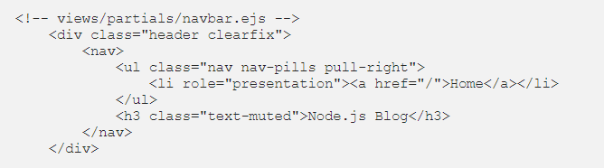

# EJS Partials

EJS Partials help us avoid repetition of the same code on several web pages. For example, you may want the same header for several web pages.
EJS partials work like EJS layouts too in creating a single fix content on a web page

**it's syntax**

### <%- include('partials/partial') %>

for EX :
Under the views/partials/ directory create a file called **navbar.ejs** which will contain only the HTML for the navigation bar at the top of the home and post pages:

