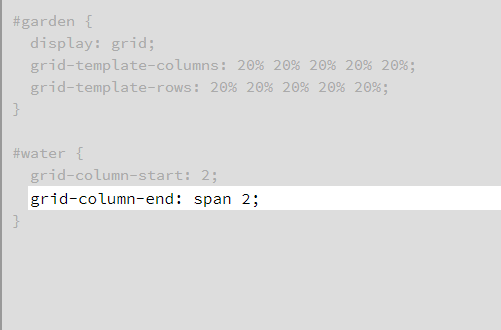

# Responsive design with CSS Grid

**CSS grid** lets us not only arrange elements in a row or a column, but in multiple rows and columns.

Grid gives us control over how wide or narrow each of the ‘grid cells’ get.
This allows us to maintain a sensible aspect ratio to their height. 
For example :

*grid-template-columns: repeat(auto-fill, minmax(250px, 1fr));*

**grid-gap property** This defines the size of the space between the columns and the rows.

If you want to count grid lines from the right instead of the left, you can give **grid-column-start** and **grid-column-end** negative values. 

Instead of defining a grid item based on the start and end positions of the grid lines, you can define it based on your desired column width using the span keyword. Keep in mind that span only works with positive values.
for ex :

