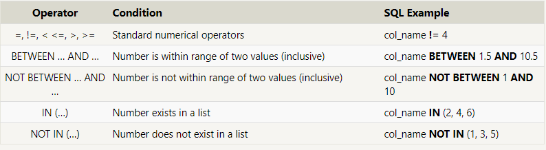
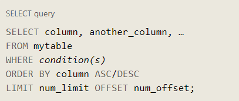

# SQL

## What is SQL?

SQL, or Structured Query Language, is a language designed to allow both technical and non-technical users query, manipulate, and transform data from a relational database. And due to its simplicity, SQL databases provide safe and scalable storage for millions of websites and mobile applications.

### SELECT queries :
To retrieve data from a SQL database, we need to write SELECT statements which are often colloquially refered to as queries.

**A query**  in itself is just a statement which declares what data we are looking for, where to find it in the database, and optionally, how to transform it before it is returned. It has a specific syntax though, which is what we are going to learn in the following exercises.

### WHERE clause in the query :
In order to filter certain results from being returned.
 The clause is applied to each row of data by checking specific column values to determine whether it should be included in the results or not.

### DISTINCT keyword :
It's provides a convenient way to discard rows that have a duplicate column value .

### GROUP BY :
to discard duplicates based on specific columns .

### ORDER BY :
 to sort your results by a given column in ascending or descending order .

 ### LIMIT and OFFSET clauses :
 The **LIMIT** will reduce the number of rows to return, and the optional **OFFSET** will specify where to begin counting the number rows from.

 *look at this example* :

 

 ## What is a Schema?
 It is describes the structure of each table, and the datatypes that each column of the table can contain.

 ### INSERT and UPDATE :
 When inserting data into a database or to update it .

### DELETE :
 When you need to delete data from a table in the database. 

### CREATE TABLE :
To create a new database table When you have new entities and relationships to store in your database.

### ALTER TABLE :
to update your corresponding tables and database schemas by add, remove, or modify columns and table constraints.

### RENAME TO :
If you need to rename the table itself .

### DROP TABLE
 to remove an entire table including all of its data and metadata, which differs from the DELETE statement in that it also removes the table schema from the database entirely.

 *EX:*
 **DROP TABLE IF EXISTS mytable;**
 

